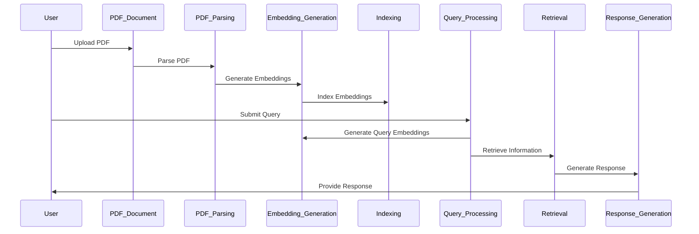

## Introduction

TeleMed-Chatbot-Generative-AI is a Retrieval-Augmented Generation (RAG) based application designed to enhance telemedicine consultations. By leveraging generative AI techniques, the chatbot can understand and respond to queries,and provide medical information from the medical book journal(pdf)
## RAG Pipeline

The RAG pipeline involves several steps to ensure accurate and relevant responses:

1. **Data Collection**: Gather medical information and patient data.
2. **Vector Store Creation**: Use Pinecone to create a vector store for efficient retrieval.
3. **Indexing**: Index the collected data into the Pinecone vector store.
4. **Query Processing**: Process patient queries to generate embeddings using Pinecone.
5. **Retrieval**: Retrieve relevant information from the vector store.
6. **Response Generation**: Pass the retrieved information through a Large Language Model (LLM) like OpenAI to generate responses.

## PDF Document Q&A

This application supports question and answering from a PDF document. The steps involved are:

1. **PDF Parsing**: Extract text from the PDF document.
2. **Embedding Generation**: Generate embeddings for the extracted text using Pinecone.
3. **Indexing**: Index the embeddings into the Pinecone vector store.
4. **Query Processing**: Process user queries to generate embeddings.
5. **Retrieval**: Retrieve relevant information from the vector store.
6. **Response Generation**: Pass the retrieved information through an LLM (OpenAI) to generate responses.

## Features

- Retrieval-Augmented Generation (RAG)
- Natural language understanding
- Medical information retrieval
- Appointment scheduling
- Patient query handling

## Installation

1. Clone the repository:
    ```bash
    git clone https://github.com/yourusername/TeleMed-Chatbot-Generative-AI.git
    ```
2. Navigate to the project directory:
    ```bash
    cd TeleMed-Chatbot-Generative-AI
    ```
3. Install the required dependencies:
    ```bash
    pip install -r requirements.txt
    ```

## Usage

1. Build the RAG pipeline:
    ```python
    python build_rag_pipeline.py
    ```
2. Run the chatbot server:
    ```bash
    python app.py
    ```
3. Access the chatbot via the provided Flask web interface or API.

## Contributing

We welcome contributions! Please read our [contributing guidelines](Readme.md) for more details.

## License

This project is licensed under the MIT License. See the [LICENSE](LICENSE) file for more information.
